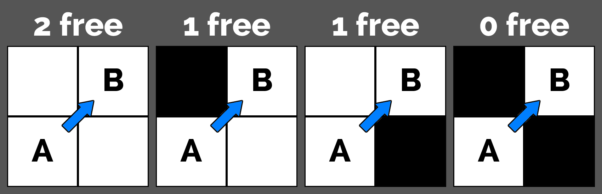

# <u>__GridHelper__</u>

This package offers utilitary API to help with operations on __2D and 3D grids__ such as tile __extraction__, __raycasting__, and __pathfinding__.

<u>__! 3D API IS STILL EXPERIMENTAL !__</u>

Comes with several demo examples.

[See online documentation](https://kevincastejon.github.io/Unity-GridHelper/)

[Get the Unity package](https://github.com/kevincastejon/Unity-GridHelper/releases/latest)

[See my other Unity packages](https://assetstore.unity.com/publishers/46935)

__[Complete API Documentation](https://kevincastejon.fr/demos/Documentations/Unity-GridHelper/)__

---
# __Usages__

All you need to use this API is a two-dimensional array (three-dimensional for 3D API) of tiles.

What is a *tile* ? Any object (custom class, struct, component, ...) that implements the very light __ITile__ interface of this library (__ITile3D__ for the 3D API). This interface requires four properties getters (five for 3D API):
- *bool* __IsWalkable__ . Must return if the tile can be walk/see throught (for pathfinding/raycasting)
- *float* __Weight__ . Must return the tile's weight (the 'cost' it will takes to walk throught that tile). Minimum is 1.
- *int* __X__ . Must return the horizontal position of the tile into the grid
- *int* __Y__ . Must return the vertical position of the tile into the grid
- *int* __Z__ . Must return the depth position of the tile into the grid (only for the 3D API and its __ITile3D__ interface)

This API is using a namespace so you have to add a using instruction to the scripts that will need this library:
```cs
using KevinCastejon.GridHelper;
```
or for the 3D API:
```cs
using KevinCastejon.GridHelper3D;
```

---
---
# __2D API__
---
---
## __MajorOrder__

When working with two-dimensional arrays there is two ways of storing tiles, first rows then lines or the opposite.<br>
This is called the __Major Order__, you can specify it on the last parameter of each method that uses a grid.<br>

__DEFAULT :__ Refers to the global setting __DefaultMajorOrder__ value<br>
__ROW_MAJOR_ORDER :__ YX. First index is rows, second is columns<br>
__COLUMN_MAJOR_ORDER :__ XY. First index is columns, second is rows<br>


---
---
## - <u>__Extraction__</u>
---
Allows you to extract tiles on a grid.<br>
Provides shape extraction (rectangles, circles, cones and lines) and neighbors extraction with a lot of parameters.

---
You can extract tiles from shapes.

- __GetTilesInARectangle__
```cs
YourCustomTileType[] tiles = Extraction.GetTilesInARectangle(grid, centerTile, rectangleSize);
```
- __GetTilesInACircle__
```cs
YourCustomTileType[] tiles = Extraction.GetTilesInACircle(grid, centerTile, radius);
```
- __GetTilesInACone__
```cs
YourCustomTileType[] tiles = Extraction.GetTilesInACone(grid, startTile, length, openingAngle, direction);
```
- __GetTilesOnALine__
```cs
YourCustomTileType[] tiles = Extraction.GetTilesOnALine(grid, startTile, length, direction);
```

---
You can extract neighbors of a tile (if existing).

- __GetTileNeighbour__
```cs
YourCustomTileType upperNeighbour = Extraction.GetTileNeighbour(grid, tile, Vector2Int.up);
```
- __GetTileNeighbours__
```cs
YourCustomTileType[] neighbours = Extraction.GetTileNeighbours(grid, tile);
```
- __GetTileOrthogonalsNeighbours__
```cs
YourCustomTileType[] orthogonalNeighbours = Extraction.GetTileOrthogonalsNeighbours(grid, tile);
```
- __GetTileDiagonalsNeighbours__
```cs
YourCustomTileType[] diagonalsNeighbours = Extraction.GetTileDiagonalsNeighbours(grid, tile);
```

---
Each extraction method has a variant to check if a specific tile would be extracted

- __IsTileInARectangle__
```cs
bool isTileInARectangle = Extraction3D.IsTileInARectangle(grid, tile, centerTile, rectangleSize);
```
- __IsTileInACircle__
```cs
bool isTileInACircle = Extraction3D.IsTileInACircle(grid, tile, centerTile, radius);
```
- __IsTileInACone__
```cs
bool isTileInACone = Extraction.IsTileInACone(grid, tile, centerTile, length, openingAngle, direction);
```
- __IsTilesOnALine__
```cs
bool isTilesOnALine = Extraction.IsTilesOnALine(grid, tile, centerTile, length, direction);
```
- __IsTileNeighbor__
```cs
bool isTileRightNeighbor = Extraction.IsTileNeighbor(tile, neighbor, Vector2Int.right);
```
- __IsTileOrthogonalNeighbor__
```cs
bool isTileOrthogonalNeighbor = Extraction.IsTileOrthogonalNeighbor(tile, neighbor);
```
- __IsTileDiagonalNeighbor__
```cs
bool isTileDiagonalNeighbor = Extraction.IsTileDiagonalNeighbor(tile, neighbor);
```
- __IsTileAnyNeighbor__
```cs
bool isTileNeighbor = Extraction.IsTileAnyNeighbor(tile, neighbor);
```

---
## - <u>__Raycasting__</u>
---
Allows you to cast lines of sight and cones of vision on a grid

---
You can get the __line of sight__ from a tile (a line that "stops" at the first encountered unwalkable tile).<br>
Many signatures are available to specify the length and direction of the line.

- __GetLineOfSight__
```cs
YourCustomTileType[] lineOfSight = Raycasting.GetLineOfSight(grid, startTile, destinationTile);
```
---
You can get the __cone of vision__ from a tile.<br>
Many signatures are available to specify the length and direction of the cone.

- __GetConeOfVision__
```cs
YourCustomTileType[] coneOfVision = Raycasting.GetConeOfVision(grid, startTile, openingAngle, destinationTile);
```
---
You can check if a line of sight or a cone of vision is clear (no non-walkable tile encountered)

- __IsLineOfSightClear__
```cs
bool isLineClear = Raycasting.IsLineOfSightClear(grid, startTile, destinationTile);
```
- __IsConeOfVisionClear__
```cs
bool isConeClear = Raycasting.IsConeOfVisionClear(grid, startTile, destinationTile);
```

---
## - <u>__Pathfinding__</u>
---
Allows you to calculate paths between tiles.<br>
This API offers several way of doing pathfinding.<br>
You can calculate the path directly every time you need (with the __CalculatePath__ method), but this can become heavy if you do it too frequently.<br>
Instead, you can generate objects that will hold multiple paths data that can be reused later. There is two types of objects that you can generate:<br>
- __PathMap__ - Will calculate and hold all the paths __to a specific tile from every accessible tiles__
- __PathGrid__ - Will calculate and hold all the paths __between each tiles on the entire grid__

*Note that, obviously, any path calculation is valid as long as the walkable state of the tiles remain unchanged*

---

You can directly calculate the path between two tiles. If there is no path between the two tiles then an empty array will be returned.<br>
You can specify a *pathfindingPolicy* parameter that holds parameters relating to diagonals and allowed movements. (see __PathfindingPolicy__)<br>

*Note that this method uses a Djikstra algorythm which can be quite intensive*
- __CalculatePath__
```cs
YourCustomTileType[] path = Pathfinding.CalculatePath(grid, startTile, destinationTile);
```

You can also calculate the path between a start tile and the closest of several destination tiles. Just pass an array of tiles instead of unique tile as third parameter.

---

### <u>__PathMap__</u>

You can generate a __PathMap__ object that holds pre-calculated paths data.<br>
This way of doing pathfinding is useful for some usages (like Tower Defenses and more) because it calculates once all the paths between one tile, called the "__target__", and all the accessible tiles from it. (The __PathMap__ generation uses __Dijkstra__ algorithm).

To generate the __PathMap__ object, use the __GeneratePathMap__ method that needs the *grid* and the *target* tile from which to calculate the paths, as parameters.

You can use an optional *maxDistance* parameter that limits the paths calculation to an amount of distance (movement 'cost' taking into account the tiles weights). Default is 0 and means no distance limit (paths to all accessible tiles, means with a clear path, from the target will be calculated).

You can specify a *pathfindingPolicy* parameter that holds parameters relating to diagonals and allowed movements. (see __PathfindingPolicy__)<br>

*Note that a PathMap generation uses a Djikstra algorythm which can be quite intensive, same as the direct path calculation method but is intended to be used less often as the calculated paths hold by the PathMap can be reused with nearly "no cost"*

```cs
PathMap<YourCustomTileType> pathMap = Pathfinding.GeneratePathMap(grid, targetTile);
```

Once the __PathMap__ object is generated, you can use its several and almost "*cost free*" methods and properties.

---

You can retrieve the tile that has been used as the target to generate this __PathMap__

- __Target__
```cs
YourCustomTileType tile = pathMap.Target;
```

You can retrieve the *maxDistance* parameter value that has been used to generate this __PathMap__. 0 means no distance limit

- __MaxDistance__
```cs
float maxDistance = pathMap.MaxDistance;
```

You can retrieve the __majorOrder__ parameter value that has been used to generate this __PathMap__

- __MajorOrder__
```cs
MajorOrder majorOrder = pathMap.MajorOrder;
```
---
You can get all the accessible tiles from the target tile.

- __GetAccessibleTiles__
```cs
YourCustomTileType[] tiles = GridHelper.GetAccessibleTiles();
```

You can get all the tiles on the path from a tile to the target.

- __GetPathToTarget__
```cs
YourCustomTileType[] tiles = pathMap.GetPathToTarget(startTile);
```

Or you can get all the tiles on the path from the target to a tile.

- __GetPathFromTarget__
```cs
YourCustomTileType[] tiles = pathMap.GetPathFromTarget(destinationTile);
```

You can know if a tile is accessible from the target tile. This is useful before calling the following __PathMap__ methods that only takes an accessible tile as parameter.

- __IsTileAccessible__
```cs
bool isTileAccessible = pathMap.IsTileAccessible(tile);
```

You can get the next tile on the path between the target and a tile.

- __GetNextTileFromTile__
```cs
YourCustomTileType nextTile = pathMap.GetNextTileFromTile(tile);
```

You can get the next tile direction on the path between the target and a tile (in 2D grid coordinates).

- __GetNextTileDirectionFromTile__
```cs
Vector2 nextTileDirection = pathMap.GetNextTileDirectionFromTile(tile);
```

You can get the distance to the target from a tile.

- __GetDistanceToTargetFromTile__
```cs
float cost = pathMap.GetDistanceToTargetFromTile(tile);
```

---
### <u>__PathGrid__</u>
You can generate a __PathGrid__ object that holds pre-calculated paths data.<br>
This way of doing pathfinding is useful for some usages because it calculates once all the paths between each tile on the entire grid. (The __PathGrid__ generation uses __Dijkstra__ algorithm on each tile of the grid).

To generate the __PathGrid__ object, use the __GeneratePathGrid__ method that needs the *grid* as parameter.

You can specify a *pathfindingPolicy* parameter that holds parameters relating to diagonals and allowed movements. (see __PathfindingPolicy__)<br>

*Note that a PathGrid generation uses a Djikstra algorythm on each tile of the grid which can be really intensive. Hopefully, in the future, asynchronous features will be added.*

```cs
PathGrid<YourCustomTileType> pathGrid = Pathfinding.GeneratePathGrid(grid);
```

Once the __PathGrid__ object is generated, you can use its several and almost "*cost free*" methods and properties.

---

You can retrieve the __majorOrder__ parameter value that has been used to generate this __PathMap__

- __MajorOrder__
```cs
MajorOrder majorOrder = pathMap.MajorOrder;
```
---
You can know if there is a clear path between two tiles.

- __IsPath__
```cs
bool isPath = GridHelper.IsPath(startTile, destinationTile);
```

You can get all the tiles on the path from a start tile to a destination tile. If there is no path between the two tiles then an empty array will be returned.

- __GetPath__
```cs
YourCustomTileType[] path = pathMap.GetPath(startTile, destinationTile);
```

You can get the next tile on the path from a start tile to the destination tile.

- __GetNextTileFromTile__
```cs
YourCustomTileType nextTile = pathMap.GetNextTileFromTile(startTile, destinationTile);
```

You can get the next tile direction on the path from a start tile to the destination tile (in 2D grid coordinates).

- __GetNextTileDirectionFromTile__
```cs
Vector2 nextTileDirection = pathMap.GetNextTileDirectionFromTile(startTile, destinationTile);
```

You can get the distance (movement cost) from a start tile to the destination tile.

- __GetDistanceBetweenTiles__
```cs
float cost = pathMap.GetDistanceBetweenTiles(startTile, destinationTile);
```

---
### - <u>PathfindingPolicy</u>

The __PathfindingPolicy__ object holds settings relating to diagonals and allowed movements.

You can set the __DiagonalsPolicy__ that represents the diagonals permissiveness. When going diagonally from a tile A to tile B in 2D grid, there are two more tile involved, the ones that are both facing neighbours of the A and B tiles. You can allow diagonals movement depending on the walkable status of these tiles.
- __DiagonalsPolicy__
```cs
pathfindingPolicy.DiagonalsPolicy = DiagonalsPolicy.ALL_DIAGONALS;
```
  - __NONE__ : no diagonal movement allowed
  - __DIAGONAL_2FREE__ : only diagonal movements, with two walkable facing neighbours common to the start and destination tiles, are allowed
  - __DIAGONAL_1FREE__ : only diagonal movements, with one walkable facing neighbour common to the start and destination tiles, are allowed
  - __ALL_DIAGONALS__ : all diagonal movements allowed



---

You can set the diagonals weight ratio multiplier that will increase the tile's weight when moving to it diagonally.

Minimum is 1. Default is 1.4142135623730950488016887242097.

Note that setting diagonals weight to 1 can lead to unpredictable behaviours on pathfinding as a diagonal move would have the same cost than orthogonal one, so the paths could become "serrated" (but still the shortests!).
- __DiagonalsWeight__
```cs
pathfindingPolicy.DiagonalsWeight = 1.5f;
```

---

You can set the __MovementPolicy__ that represents the movement permissiveness. It is useful to allow special movement, especially for side-view games, such as spiders that can walk on walls or roofs, or flying characters. Default is FLY. Top-down view grid based games should not use other value than the default as they do not hold concept of "gravity" nor "up-and-down".

Note that this parameter is a flag enumeration, so you can cumulate multiple states, the FLY state being the most permissive and making useless its combination with any other one.
- __MovementPolicy__
```cs
pathfindingPolicy.MovementPolicy = MovementPolicy.ALL_DIAGONALS;
```
  - __FLY__ : all walkable tiles can be walk thought
  - __WALL_BELOW__ : the walkable tiles that has a not-walkable lower neighbour can be walk thought
  - __WALL_ASIDE__ : the walkable tiles that has a not-walkable side neighbour can be walk thought
  - __WALL_ABOVE__ : the walkable tiles that has a not-walkable upper neighbour can be walk thought


---
## 3D API

---
### - <u>Extraction3D</u>

You can always specify a *majorOrder* parameter that tells which indexes order to use for the grid. Default is YXZ

You can extract tiles in a sphere, or in a cuboid, around a tile.

- __GetTilesInACuboid__
```cs
YourCustomTileType[] tiles = Extraction3D.GetTilesInACuboid(grid, centerTile, rectangleSize);
```
- __GetTilesInASphere__
```cs
YourCustomTileType[] tiles = Extraction3D.GetTilesInASphere(grid, centerTile, radius);
```

You can also get only the walkable tiles in a sphere/cuboid, around a tile.

- __GetWalkableTilesInACuboid__
```cs
YourCustomTileType[] tiles = Extraction3D.GetWalkableTilesInACuboid(grid, centerTile, rectangleSize);
```
- __GetWalkableTilesInASphere__
```cs
YourCustomTileType[] tiles = Extraction3D.GetWalkableTilesInASphere(grid, centerTile, radius);
```

You can also get only the tiles on the sphere/cuboid outline.

- __GetTilesOnACuboidOutline__
```cs
YourCustomTileType[] tiles = Extraction3D.GetTilesOnACuboidOutline(grid, centerTile, rectangleSize);
```
- __GetTilesOnASphereOutline__
```cs
YourCustomTileType[] tiles = Extraction3D.GetTilesOnASphereOutline(grid, centerTile, radius);
```

Finally, you can also get only the walkable tiles on the sphere/cuboid outline.

- __GetWalkableTilesOnACuboidOutline__
```cs
YourCustomTileType[] tiles = Extraction3D.GetWalkableTilesOnACuboidOutline(grid, centerTile, rectangleSize);
```
- __GetWalkableTilesOnASphereOutline__
```cs
YourCustomTileType[] tiles = Extraction3D.GetWalkableTilesOnASphereOutline(grid, centerTile, radius);
```

You can get neighbour of a tile (if it exists).

- __GetTileNeighbour__
```cs
YourCustomTileType frontNeighbour = Extraction3D.GetTileNeighbour(tile, Vector3Int.forward);
```

Besides from extracting tiles, you can know if a specific tile is contained into a sphere/cuboid or not. Same with the outlines.

- __IsTileInACuboid__
```cs
bool isTileInACuboid = Extraction3D.IsTileInACuboid(centerTile, tile, rectangleSize);
```
- __IsTileInACuboidOutline__
```cs
bool isTileInACuboidOutline = Extraction3D.IsTileInACuboidOutline(centerTile, tile, rectangleSize);
```
- __IsTileInASphere__
```cs
bool isTileInASphere = Extraction3D.IsTileInASphere(centerTile, tile, radius);
```
- __IsTileInASphereOutline__
```cs
bool isTileInASphereOutline = Extraction3D.IsTileInASphereOutline(centerTile, tile, radius);
```

---
### - <u>Raycasting3D</u>

You can always specify a *majorOrder* parameter that tells which indexes order to use for the grid. Default is YXZ

You can get all the tiles on a line between two tiles

- __GetTilesOnALine__
```cs
YourCustomTileType[] tiles = Raycasting3D.GetTilesOnALine(grid, startTile, destinationTile);
```

You can also get only the walkable tiles on a line between two tiles

- __GetWalkableTilesOnALine__
```cs
YourCustomTileType[] tiles = Raycasting3D.GetWalkableTilesOnALine(grid, startTile, destinationTile);
```

You can get the line of sight between two tiles (a line that "stops" at the first encountered unwalkable tile)

- __GetLineOfSight__
```cs
YourCustomTileType[] tiles = Raycasting3D.GetLineOfSight(grid, startTile, destinationTile);
```

You can know if the line of sight between two tiles is clear (has not encountered any unwalkable tile)

- __IsLineOfSightClear__
```cs
bool isLineClear = Raycasting3D.IsLineOfSightClear(grid, startTile, destinationTile);
```

---
### - <u>Pathfinding3D</u>

The pathfinding part of this library generates a __PathMap3D__ object that holds all the calculated paths data.

This way of doing pathfinding is useful for some usages (like Tower Defenses and more) because it calculates once all the paths between one tile, called the "__target__", and all the others accessible tiles. (The __PathMap3D__ generation uses __Dijkstra__ algorithm).

To generate the __PathMap3D__ object, use the __GeneratePathMap__ method that needs the *grid* and the *target* tile from which to calculate the paths, as parameters.

You can use an optional *maxDistance* parameter that limits the paths calculation to an amount of distance (movement 'cost' including the tiles weights). Default is 0 and means no distance limit (paths to all accessible tiles on the entire grid will be calculated).

You can specify a *pathfindingPolicy* parameter that holds parameters relating to diagonals and allowed movements. (see __Pathfinding3DPolicy__)

You can specify a *majorOrder* parameter that tells which indexes order to use for the grid. Default is YXZ

```cs
PathMap3D<YourCustomTileType> pathMap = Pathfinding3D.GeneratePathMap(grid, targetTile, maxDistance);
```

---
### - <u>PathMap3D</u>

Once the __PathMap3D__ object is generated, you can use its several and almost "*cost free*" methods and properties.

You can retrieve the tile that has been used as the target to generate this __PathMap3D__

- __Target__
```cs
YourCustomTileType tile = pathMap.Target;
```

You can retrieve the *maxDistance* parameter value that has been used to generate this __PathMap3D__

- __MaxDistance__
```cs
float maxDistance = pathMap.MaxDistance;
```

You can retrieve the __majorOrder__ parameter value that has been used to generate this __PathMap3D__

- __MajorOrder__
```cs
MajorOrder3D majorOrder = pathMap.MajorOrder;
```

You can get all the accessible tiles from the target tile.

- __GetAccessibleTiles__
```cs
YourCustomTileType[] tiles = GridHelper.GetAccessibleTiles();
```

You can get all the tiles on the path from a tile to the target.

- __GetPathToTarget__
```cs
YourCustomTileType[] tiles = pathMap.GetPathToTarget(startTile);
```

Or you can get all the tiles on the path from the target to a tile.

- __GetPathFromTarget__
```cs
YourCustomTileType[] tiles = pathMap.GetPathFromTarget(destinationTile);
```

---
### - <u>PathMap3D</u> - other features

You can get info on a specific tile through some __PathMap3D__ methods.


You can know if a tile is accessible from the target tile. This is useful before calling the following __PathMap3D__ methods that only takes an accessible tile as parameter.

- __IsTileAccessible__
```cs
bool isTileAccessible = pathMap.IsTileAccessible(tile);
```

You can get the distance to the target from a tile.

- __GetDistanceToTargetFromTile__
```cs
float cost = pathMap.GetDistanceToTargetFromTile(tile);
```

You can get the next tile on the path between the target and a tile.

- __GetNextTileFromTile__
```cs
YourCustomTileType nextTile = pathMap.GetNextTileFromTile(tile);
```

You can get the next tile direction on the path between the target and a tile (in 2D grid coordinates).

- __GetNextTileDirectionFromTile__
```cs
Vector3 nextTileDirection = pathMap.GetNextTileDirectionFromTile(tile);
```
